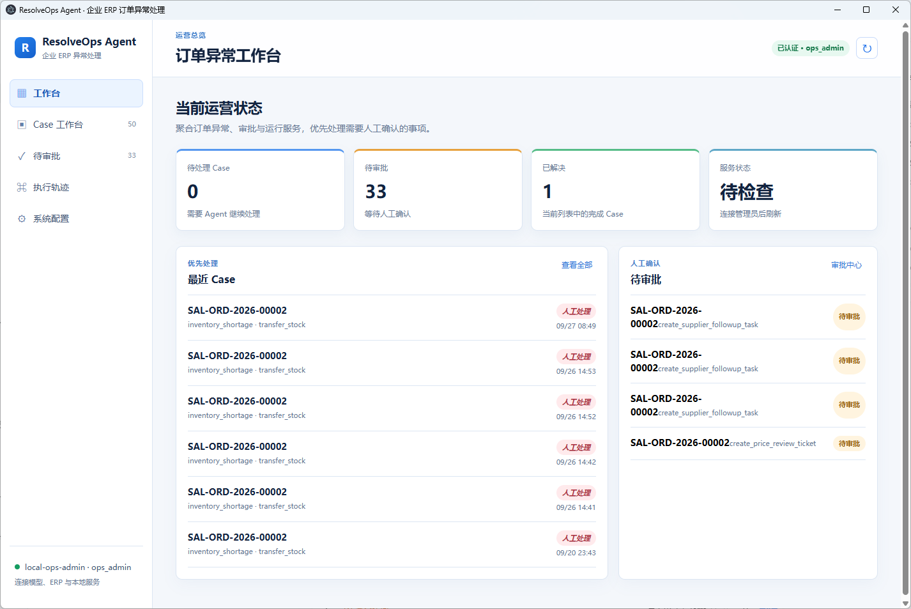

<div align="center">

# ResolveOps Agent

**ERP 订单异常处理桌面端：调查、审批、执行和验证集中在一个 Case 中。**

[快速开始](#快速开始) · [桌面端](#桌面端) · [架构](#一个-case-如何流转) · [文档](#文档)

</div>



ResolveOps 用于处理库存短缺、价格不一致和交付延期。订单异常进入系统后，Worker 调查 ERP 事实，生成方案；审批通过后由 Executor 执行，并回读 ERP 确认结果。

## 快速开始

### 运行工作台

```powershell
git clone https://github.com/Chaofei-liu666/resolveops.git
cd resolveops
Copy-Item .env.example .env
python -m venv .venv
.\.venv\Scripts\Activate.ps1
python -m pip install -r requirements-dev.txt
python scripts/dev.py
```

打开 <http://127.0.0.1:8090/>。另开一个终端检查运行状态：

```powershell
Invoke-RestMethod http://127.0.0.1:8090/healthz
```

预期结果：`status` 为 `ok`。本地数据写入 `data/resolveops.db`；`Ctrl+C` 停止 API 和 Worker。

### 运行完整案例

在“系统配置”填写 ERPNext 和 LLM 连接，或编辑 `.env` 后重启运行时。随后在工作台新建 `inventory_shortage` Case，使用 ERPNext 中已有的订单号。

完整案例会依次经历：

```text
读取订单、库存和调拨路线
→ 生成调拨或采购方案
→ 等待指定角色审批
→ 写入 ERPNext 草稿单据
→ 回读单据，更新 Case 结果
```

详细配置见[快速开始文档](docs/quickstart.md)。

## 一个 Case 如何流转

```text
创建 Case
  → Worker 领取调查任务
  → LLM 与只读工具收集事实
  → Evidence Grounding 校验 Action Plan
  → Policy 计算审批角色
  → Approval
  → Executor 写入 ERP
  → Verification 回读结果
```

Case、Task、Event、Approval 和 Invocation 都会持久化。执行轨迹页面显示每一步的事件；Case 详情保留方案、审批和执行结果。

## 主对话与意图路由

左侧“主对话”入口提供项目问答与运营分析。普通问题进入无工具对话；当问题同时包含运行数据对象与统计、查询、排序等分析意图时，路由到只读分析链路。分析链路用两次 LLM 调用完成“问题 → 只读 SQL → 结果摘要”，可跨 Case、审批、事件、任务和调用记录进行关联与统计。

模型只能查询当前租户的分析语义层；SQL 仅允许 `SELECT`、关联、聚合和 CTE，单次结果最多 100 行。生成的 SQL 与结果行数会写入审计日志，不能修改 Case、审批或 ERP 数据。

## 运行时约束

| 位置 | 规则 |
|---|---|
| 工具 | 模型仅看到当前 Case 所需的只读工具；参数经过 schema 和业务范围检查。 |
| 方案 | 模型返回 Action Plan，方案必须关联已观察到的业务证据。 |
| 审批 | 审批绑定 Case、Plan Version 与 Action Hash；身份由 API Key 在服务端解析。 |
| 执行 | Executor 使用幂等键写入 ERP，并在写后读取结果。 |
| 失败 | 库存变化、审批驳回或验证失败会触发重新调查或人工处理。 |

## 桌面端

Windows 桌面端包含 Electron 窗口、内置 API、Worker 和 SQLite Runtime。构建安装包：

```powershell
cd desktop\electron
npm install
npm run dist:win
```

安装包位于 `desktop\electron\dist`，作为 GitHub Release 附件发布。构建和本地数据位置见 [desktop/README.md](desktop/README.md)。

## 开发

| 想做什么 | 从这里开始 |
|---|---|
| 修改 Agent 调查逻辑 | `production/agent.py`、`production/agent_core/` |
| 添加或调整工具 | `production/tools.py`、`production/actions.py` |
| 调整审批与执行 | `production/policy.py`、`production/executors.py` |
| 修改工作台 | `static/` |
| 运行测试 | `.\scripts\test.ps1` |

本地运行时默认使用 SQLite。共享部署可将 `DATABASE_URL` 配置为 PostgreSQL，详细边界见[服务端部署](docs/deployment.md)。

## 文档

- [文档导航](docs/README.md)
- [从源码启动和运行完整案例](docs/quickstart.md)
- [架构与扩展点](docs/architecture.md)
- [运行、审批和排障](docs/runbook.md)
- [评测与故障注入](docs/evals.md)
- [服务端部署（草案）](docs/deployment.md)
- [贡献指南](CONTRIBUTING.md)

## 安全边界

项目使用 ERPNext 沙箱进行集成验证。真实生产接入前需要补齐 IAM、密钥管理、备份恢复、监控告警与压测。`.env`、本地数据库、安装包和客户数据均不进入 Git。

## License

MIT License，详见 [LICENSE](LICENSE)。
