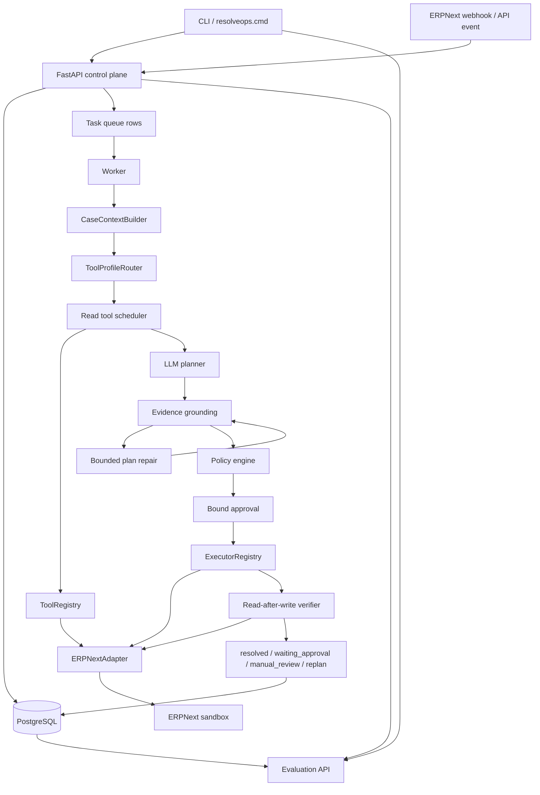

# Architecture diagram

This is the current runtime shape. ERPNext is the reference adapter, not the whole design.



## Runtime boundaries

| Boundary | Why it exists |
|---|---|
| CLI -> API | The CLI is a client. It never talks to ERPNext directly. |
| Read tools -> LLM | The model can request read-only evidence through schemas. |
| LLM -> Action plan | The model proposes write actions as data, not executable functions. |
| Evidence grounding | Action arguments must match observed tool evidence. |
| Policy engine | The model cannot grant itself permission. |
| Bound approval | Approval is tied to Case, plan version and action hash. |
| Executor | All ERP writes go through one controlled boundary. |
| Verifier | Tool success is not trusted until the system reads ERPNext again. |

## Agent loop

```text
investigate
-> propose
-> validate evidence
-> repair once if needed
-> policy check
-> approval
-> execute
-> verify
-> resolve / replan / manual_review
```

The repair step is bounded by `AGENT_MAX_PLAN_REPAIRS`. The current default is one repair attempt.

## State model

ResolveOps uses database state instead of chat history as the source of truth:

```text
case_id      durable business Case
task_id      background work item
event_id     audit trail event
approval_id  bound human approval
invocation_id write execution record
```

This keeps multiple Cases isolated even when the same operator uses the same CLI session.
